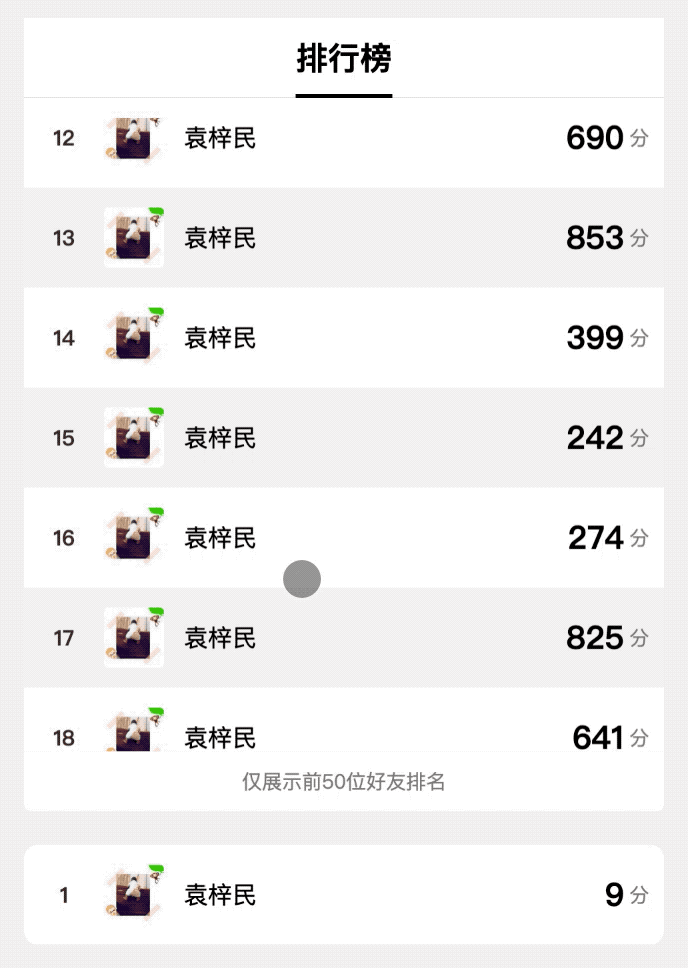

# minigame-canvas-engine
轻量级canvas渲染引擎。

[](https://badge.fury.io/js/minigame-canvas-engine)
[](https://travis-ci.org/wechat-miniprogram/minigame-canvas-engine)
[](https://coveralls.io/github/wechat-miniprogram/minigame-canvas-engine?branch=master)
[](https://github.com/yuanzm/opendatacontextenginetest)

## 简介
原生js开发canvas界面困难而可维护性差，而引入一款游戏引擎又显得太过笨重。本项目旨在让开发者通过类Web开发的方式来降低canvas的开发门槛。

详细原理介绍文章：https://segmentfault.com/a/1190000021297495?_ea=27021986

## web端调试
为了方便UI调试，可以在线编辑预览效果: [Playground](https://wechat-miniprogram.github.io/minigame-canvas-engine/)

## 效果预览


## 更新日志
详见[CHANGELOG.md](CHANGELOG.md)

## 安装使用

 1. 克隆本项目到合适的文件夹或者通过Bower安装。
 ```
    // git安装方式
    git clone https://github.com/wechat-miniprogram/minigame-canvas-engine
    // npm安装方式
    bower install minigame-canvas-engine
 ```

 2. 引用渲染引擎：
 ```
 import Layout from 'minigame-canvas-engine'
 ```

 3. 编写模板字符串：这里采用XML去描述界面，而且支持有限的标签。需要特别注意的是，模板字符串只能有一个根节点，第二个节点会被忽略。如果想让模板更加强大，可以借助第三方模板引擎如[dot.js](https://olado.github.io/doT/index.html)。

 ```
    let template = `
     <view id="container">
        <text id="testText" class="redText" value="hello canvas">
     </view>
    `
 ```

 4. 编写样式：样式为一个style对象，与Web开发不同的是，不受属性前后顺序的影响，class的属性会覆盖id的同名属性。tips: 由于采用了第三方的布局引擎css-layout，在编写样式的时候为所有元素都设置好width和height属性会更容易得到想要的效果，其中**根节点**必须设置width和height属性。

 ```
    let style = {
        container: {
            width: 200,
            height: 100,
            backgroundColor: '#ffffff',
            justContent: 'center',
            alignItems: 'center',
        },
        testText: {
            color: '#ffffff',
            width: 200,
            height: 50,
            lineHeight: 50,
            fontSize: 20,
            textAlign: 'center',
        },
        // 文字的最终颜色为#ff0000
        redText: {
            color: '#ff0000',
        }
    }
 }
 ```
 5. 初始化渲染引擎：将第二第三步编写的模板和样式传给渲染引擎，渲染引擎会生成布局树和渲染树等，准备渲染到canvas上面。

 ```
    Layout.init(template, style);
 ```

 6. 执行渲染：指定被渲染的context，绘制UI
 ```
 // sharedContext自行创建
 Layout.layout(sharedContext);
 ```
 7. 如果本渲染引擎在子域中使用，需要设置主域的渲染信息：
 ```
 // 设置sharedCancas在主域绘制的物理尺寸和位置信息，这一步非常重要，因为子域渲染引擎并不关心外部使用的引擎是什么，而是自己监听触摸事件来进行事件处理，因此需要拿到真实的物理尺寸、位置信息来执行事件处理。
  Layout.updateViewPort({
        width : 200,
        height: 100,
        x     : 100,
        y     : 100
  });
 ```

## **API**

### **LayoutAPI**

#### 1. Layout.getElementsById(String elementId)
获取元素id为**elementId**的一组元素

#### 2. Layout.getElementsByClassName(String className)
获取包含class为**className**的一组元素

#### 3. Layout.clear()
清理画布，之前的计算出来的渲染树也会一并清理，此时可以再次执行init和layout方法渲染界面。

#### 4. Layout.clearPool()
调用此API可以清理对象池，释放内存

#### 5. Layout.clearAll()
等价于按序调用Layout.clear和Layout.clearPool.

#### 6. Layout.loadImgs(Array imgarr)
对于图片资源，如果不提前加载，渲染过程中可能出现挨个出现图片效果，影响体验。通过Layout.loadImgs可以预加载图片资源，在调用Layout.layout的时候渲染性能更好，体验更佳。
```
// 注意图片路径不需要加./作为前缀，以小游戏根目录作为根目录
Layout.loadImgs([
    'sub/Buffet_icon_GiftPlate_0.png',
    'sub/Buffet_icon_GiftPlate.png',
    'sub/UI_Icon_Rating.png',
]);

```

### **事件API**
通过getElementsById或者getElementsByClassName获取元素之后，可以的绑定事件，支持的事件有`touchstart`、`touchmove`、`touchend`、`touchcancel`、`click`,示例如下：
```
const list = Layout.getElementsByClassName('listItem');

list.forEach(item => {
    item.on('touchstart', (e) => {
        console.log(e, item);
    });
});
```

### **属性API**
通过Layout.getElementsById和Layout.getElementsByClassName获取image和text之后，修改图片的链接或者文本的值会自动重渲染界面。
```
let img = Layout.getElementsById('testimgid')[0];
img.src = 'newimgsrc';

let text = Layout.getElementsById('tesettextid')[0];
text.value = 'newtextvalue';
```

### **标签**

#### 标签列表

|      标签      |            说明          |
|----------------|----------------             |
| view           | 容器标签，与HTML中的div相似 |
| scrollview           | 滚动列表容器，如果容器内的子元素高度大于scrollview高度，支持纵向滚动，不支持嵌套scrollview |
| image           | 图片标签，注意图片路径不需要加./作为前缀，以小游戏根目录作为根目录 |
| text           | 文本标签 |

#### 标签属性
|      属性      |  类型  | 是否必填 |          说明          |
|----------------|--------|--------|------------------------|
| id  | string |    否 | 非唯一标识，两个标签可以共用id
| class | string |    否    | 与浏览器相同 |
| value     | string |   否     | text标签支持 |
| src      | string |   否    | image标签才支持 |

### **样式**
**布局**

| 属性名                | 支持的值或类型                                            | 默认值     |
| --------------------- | --------------------------------------------------------- | ---------- |
| width                 | number                                                    | 0          |
| height                | number                                                    | 0          |
| position              | relative, absolute                                        | relative   |
| left                  | number                                                    | 0          |
| top                   | number                                                    | 0          |
| right                 | number                                                    | 0          |
| bottom                | number                                                    | 0          |
| margin                | number                                                    | 0          |
| marginLeft            | number                                                    | 0          |
| marginRight           | number                                                    | 0          |
| marginTop             | number                                                    | 0          |
| marginBottom          | number                                                    | 0          |
| padding               | number                                                    | 0          |
| paddingLeft           | number                                                    | 0          |
| paddingRight          | number                                                    | 0          |
| paddingTop            | number                                                    | 0          |
| paddingBottom         | number                                                    | 0          |
| borderWidth           | number                                                    | 0          |
| borderRadius          | number                                                    | 0          |
| flexDirection         | column, row                                               | row        |
| flexShrink            | number                                                    | 1          |
| flexGrow              | number                                                    |            |
| flexWrap              | wrap, nowrap                                              | nowrap     |
| justifyContent        | flex-start, center, flex-end, space-between, space-around | flex-start |
| alignItems, alignSelf | flex-start, center, flex-end, stretch                     | flex-start |

**文本**

| 属性名          | 支持的值或类型      | 默认值      |
| --------------- | ------------------- | ----------- |
| fontSize        | number              | 14          |
| lineHeight      | number / string     | '1.4em'     |
| textAlign       | left, center, right | left        |
| verticalAlign   | top, middle, bottom | top         |
| color           | string              | #000000     |
| backgroundColor | string              | transparent |
| textOverflow    | ellipsis, clip       | 默认为空，出于性能考虑，只有显式指定textOverflow属性的时候才会对文字进行截断处理 |

**容器**

|      属性     |  类型  | 默认值 |           说明           |
|---------------|--------|--------|--------------------------|
| backgroundColor       | string |        | 背景的颜色，支持 6 位 16 进制、8 位 16 进制、rgb、rgba 四种格式的颜色                   |


**边框**

| 属性 | 类型 | 默认值 | 说明 |
|---------------|--------|--------|--------------------------|
| borderRadius | number | | 边框圆角 |
| borderColor | string |  | 边框颜色，支持 6 位 16 进制、8 位 16 进制、rgb、rgba 四种格式的颜色 |

