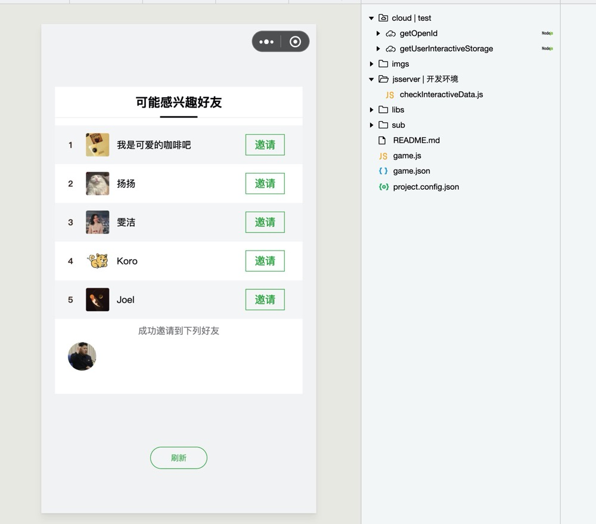

# 小游戏定向分享示例

## 安装使用

### step0. 背景介绍
本项目开放数据域的绘制均采用了[轻量级canvas渲染引擎](https://github.com/wechat-miniprogram/minigame-canvas-engine)，该引擎允许用类web开发的方式开发canvas界面，并且提供了[在线调试](https://wechat-miniprogram.github.io/minigame-canvas-engine/)功能，具体使用可以[查看文档](https://github.com/wechat-miniprogram/minigame-canvas-engine/blob/master/README.md)

### step1. 下载导入项目
将[本项目](https://github.com/wechat-miniprogram/minigame-canvas-engine/tree/master/demos/cocoscreator)克隆至任意文件夹，并且将目录`demos/interactivedemo`导入微信开发者工具，导入项目过程中必须填写自己的appid（涉及云开发能力）

### step2. 部署云函数
如果游戏没有开通云开发能力，按照[文档指引](https://developers.weixin.qq.com/minigame/dev/wxcloud/basis/quickstart.html)开通云开发，并且部署云函数`getOpenId`和`getUserInteractiveStorage`。

### step3. 部署jsserver
调用API`wx.modifyFriendInteractiveStorage`需要依赖jsserver能力，因此需要将文件`jsserver/checkInteractiveData.js`右键上传部署到开发环境。

### step4. 预览体验
由于定向分享能力暂时只能在真机调试，所以本示例的体验请按照以上步骤部署之后扫码体验。工具上运行结果如下：

