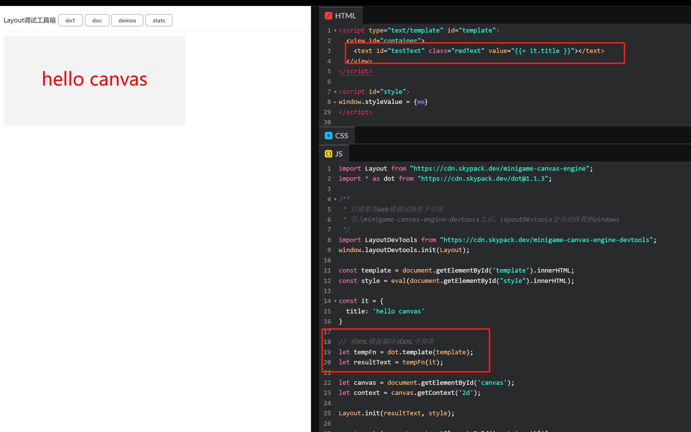
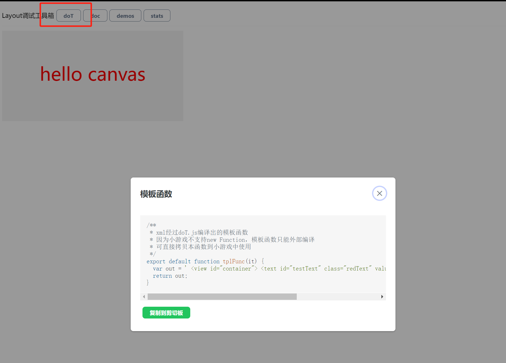

# 模板引擎使用

## 模板引擎简介

Layout 使用 XML 来组织页面布局，比如快速入门里面提到的:
```js
let template = `
  <view id="container">
    <text id="testText" class="redText" value="hello canvas"></text>
  </view>
`;
```
除了 xml 标签，要渲染出页面内容，最关键的还是有数据，因此一般将页面内容定义成**模板 + 数据**。如果页面内容不复杂，按照上面的方式拼模板并不会有太大的问题，但像游戏排行榜这样的场景，一般需要包含排名、昵称、分数等各种信息，手动拼模板字符串就会大大降低代码可维护性。

在 Web 开发领域，一般会用模板引擎来解决这个问题，不同模板引擎功能上可能略有差别，但一般会支持条件渲染、循环等操作。经过模板引擎编译后会得到一个模板函数，模板函数接受数据，就得到了页面内容。

关于选择什么模板引擎，其实并没有太大的考量，Layout 仅仅是推荐 [doT.js](http://olado.github.io/doT/index.html)。

## doT.js 基本使用
用 doT.js 编写的模板默认接收 it 对象作为数据，常见的操作如下：
### 插值

```js
// 语法
{{= }}

// 示例
<text id="testText" class="redText" value="{{= it.title}}"></text>
```
### 循环
```js
// 语法
{{~ }}

// 示例
{{~it.data :item:index}}
  <view class="listItem">
    <text font="fnt_number-export" class="listItemNum" value="{{= index + 1}}"></text>
      <image class="listHeadImg" src="{{= item.avatarUrl }}"></image>
    <text class="listItemName" value="{{= item.nickname}}"></text>
    <text class="listItemScore" value="{{= item.rankScore}}"></text>
    <text class="listScoreUnit" value="分"></text>
  </view>
{{~}}
```
示例里面it.data是一个 Array，代表排行榜列表，此处可以循环生成一组标签，每组标签代表列表里面的一项数据(item)，每项数据(item)又会包含排行数据需要的头像、昵称、分数等信息。

### 条件判断

```js
// 语法
{{? }}

// 示例
{{~it.data :item:index}}
  {{? index % 2 === 1 }}
    <view class="listItem listItemOld">
  {{?}}
  {{? index % 2 === 0 }}
    <view class="listItem">
  {{?}}
    <text font="fnt_number-export" class="listItemNum" value="{{= index + 1}}"></text>
      <image class="listHeadImg" src="{{= item.avatarUrl }}"></image>
    <text class="listItemName" value="{{= item.nickname}}"></text>
    <text class="listItemScore" value="{{= item.rankScore}}"></text>
    <text class="listScoreUnit" value="分"></text>
  </view>
{{~}}
```
示例里面，条件判断了当前 index 是奇数还是偶数给与 view 标签设置不一样的 class，针对不同的 class 可以设置不同的样式，这就很方便实现列表里面奇数和偶数项实现不同的底色。如果是想高亮排行榜里面的前三名，同样可以用类似的条件判断。

doT.js 还提供了在线的模板编译操作（ http 的链接[http://olado.github.io/doT/index.html](http://olado.github.io/doT/index.html)才能出来这在线编译）：


## Layout devtools集成
除了使用 doT.js 提供的在线模板编译，Layout 更推荐通过 codepen 来创建和维护模板，具体使用步骤如下

### 通过模板创建 codepen 
1. 点击[https://codepen.io/pen?template=VwEeLKw](https://codepen.io/pen?template=VwEeLKw)，会创建一个包含Layout hello world示例的模板，该模板已经包含了 doT.js 的基本操作。




### 导出模板函数
因为小游戏不能使用 new Function 和 eval 等操作，所以模板函数必须提前导出，点击顶部 Layout 调试工具箱的 dot，会调用 doT.js 编译出模板函数，将此模板函数复制到小游戏内可以直接使用。



### 永久化保存
模板难免反复编辑和迭代，为了永久化保存，可以点击 Save 保存到自己的 codepen 账户。 

